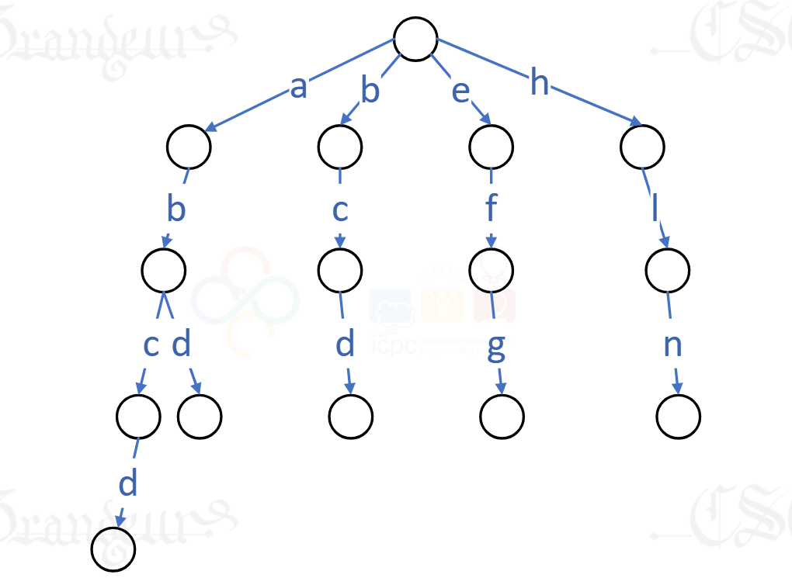

Description
Trie树又称单词查找树，是一种树形结构，如下所示。

TRIE
TRIE
它是一种哈希树的变种。典型应用是用于统计，排序和保存大量的字符串（但不仅限于字符串），所以经常被搜索引擎系统用于文本词频统计。它的优点是：利用字符串的公共前缀来节约存储空间，最大限度地减少无谓的字符串比较，查询效率比哈希表高。

输入的一组单词，创建Trie树。输入字符串，计算以该字符串为公共前缀的单词数。

（提示：树结点有26个指针，指向单词的下一字母结点。）

Input
测试数据有多组

每组测试数据格式为：

第一行：一行单词，单词全小写字母，且单词不会重复，单词的长度不超过10

第二行：测试公共前缀字符串数量t

后跟t行，每行一个字符串

Output
每组测试数据输出格式为：

第一行：创建的Trie树的层次遍历结果

第2~t+1行：对每行字符串，输出树中以该字符串为公共前缀的单词数。

Sample
#0
Input
abcd abd bcd efg hig
3
ab
bc
abcde
Output
abehbcficddggd
2
1
0