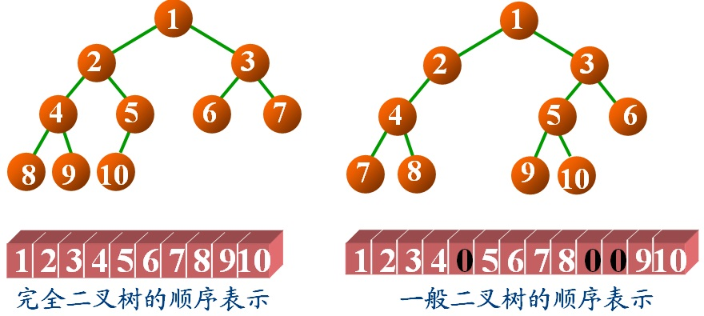

Description
二叉树可以采用数组的方法进行存储，把数组中的数据依次自上而下,自左至右存储到二叉树结点中，一般二叉树与完全二叉树对比，比完全二叉树缺少的结点就在数组中用0来表示。如下图所示

二叉树数组表示
从上图可以看出，右边的是一颗普通的二叉树，当它与左边的完全二叉树对比，发现它比完全二叉树少了第5号结点，所以在数组中用0表示，同样它还少了完全二叉树中的第10、11号结点，所以在数组中也用0表示。

结点存储的数据均为非负整数

Input
第一行输入一个整数t，表示有t个二叉树

第二行起，每行输入一个数组，先输入数组长度，再输入数组内数据，每个数据之间用空格隔开，输入的数据都是非负整数

连续输入t行

Output
每行输出一个示例的先序遍历结果，每个结点之间用空格隔开

Sample
#0
Input
3
3 1 2 3
5 1 2 3 0 4
13 1 2 3 4 0 5 6 7 8 0 0 9 10
Output
1 2 3 
1 2 4 3 
1 2 4 7 8 3 5 9 10 6 
Hint
注意从数组位置和二叉树深度、结点位置进行关联，或者父子结点在数组中的位置存在某种关联，例如i, i+1, i/2, i+1/2……..或者2i, 2i+1…….仔细观察哦