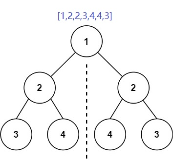

Description
给定二叉树，检查该二叉树是否为镜像对称的。

Input
第一行输入t，表示有t个测试样例。
第二行起，每一行首先输入n，接着输入n个整数代表一个二叉树。
依次输入t个二叉树。
数组形式的二叉树表示方法与题目：DS二叉树_伪层序遍历构建二叉树 相同，输入-1表示空结点。
Output
每一行输出二叉树是否为镜像对称。
依次输出t行。
Sample
#0
Input
4
7 1 2 2 3 4 4 3
7 1 2 2 -1 3 -1 3
7 10 20 20 -1 40 40 -1
5 1 2 2 -1 3
Output
true
false
true
false
Hint
结点个数 >= 1
n >= 1
1 <= 结点值 <= 1000