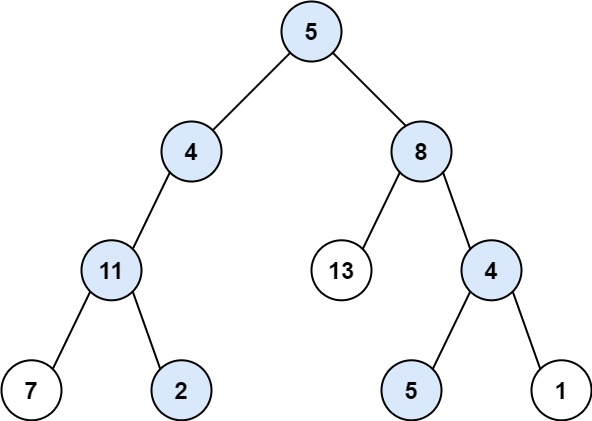

Description
给定二叉树和一个整数目标targetSum，输出所有从根结点到叶子结点的路径总和等于targetSun的路径。

Input
第一行输入t，表示有t个测试样例。
第二行起，每一行首先输入一个整数targetSum，接着输入n，接着输入n个整数代表一个二叉树。
以此类推共输入t个测试样例。
数组形式的二叉树表示方法与题目：DS二叉树_伪层序遍历构建二叉树 相同，输入-1表示空结点。
Output
每一行输出一个符合题意的路径，若当前的二叉树没有符合题意的路径存在，则输出"Path not found"。
每个测试样例之间用一个空行隔开。
注意输出末尾的空格。
Sample
#0
Input
4

22
13
5 4 8 11 -1 13 4 7 2 -1 -1 5 1

5
3
1 2 3

1
2
1 1

1
1
1
Output
5 4 11 2 
5 8 4 5 

Path not found

Path not found

1 
Hint
结点个数 >= 1
结点值 >= 1
n >= 1
targetSum >= 1