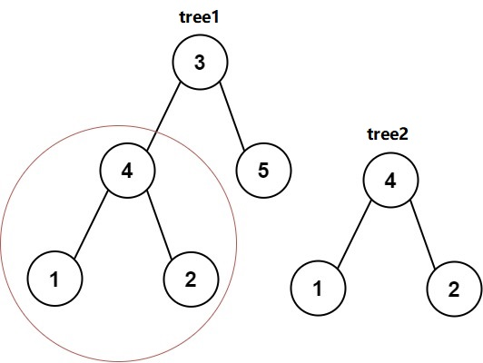
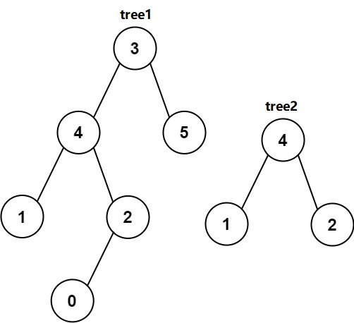

Description
给你两棵二叉树tree1和tree2，检验tree1中是否包含和tree2具有相同结构和结点值的子树。如果存在，输出true；否则，输出false。

 

Input
第一行输入t，表示有t个测试样例。
第二行首先输入n1，接着输入n1个整数，表示二叉树tree1。
第三行首先输入n2，接着输入n2个整数，表示二叉树tree2。
以此类推，每两行输入一个测试样例，共输入t个测试样例。
数组形式的二叉树表示方法与题目：DS二叉树_伪层序遍历构建二叉树 相同，输入-1表示空结点。
Output
每一行输出当前测试样例是否符合题意。
共输出t行。
Sample
#0
Input
5

5 3 4 5 1 2
3 4 1 2

10 3 4 5 1 2 -1 -1 -1 -1 0
3 4 1 2

5 3 4 5 1 2
5 50 4 60 1 2

1 3
1 3

7 1 2 2 3 4 3 3
3 2 3 3
Output
true
false
false
true
true
Hint
tree1结点数量 >= 1
tree2结点数量 >= 1
所有结点的值 >= 1
