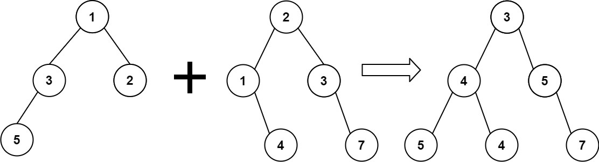

Description
给定两个二叉树，输出这两个二叉树合并后形成的二叉树，依次输出前序遍历、中序遍历、后序遍历。

Input
第一行输入t，表示有t个测试样例。
第二行首先输入n1，接着输入n1个整数，用于代表二叉树tree1。
第三行首先输入n2，接着输入n2个整数，用于代表二叉树tree2。
以此类推，每两行输入一个测试样例的两个二叉树。
共输入t个测试样例。
数组形式的二叉树表示方法与题目：DS二叉树_伪层序遍历构建二叉树 相同，输入-1表示空结点。
Output
每三行依次输出合并后的二叉树的前序遍历、中序遍历、后序遍历。
共输出t个二叉树。
注意输出末尾的空格。
Sample
#0
Input
5
4 1 3 2 5
7 2 1 3 -1 4 -1 7

1 1
1 1

5 1 2 -1 3 4
1 1

1 1
5 1 2 3 -1 4

4 1 2 -1 3
5 1 -1 2 -1 3
Output
3 4 5 4 5 7 
5 4 4 3 5 7 
5 4 4 7 5 3 

2 
2 
2 

2 2 3 4 
3 2 4 2 
3 4 2 2 

2 2 4 3 
2 4 2 3 
4 2 3 2 

2 2 3 2 3 
3 2 2 2 3 
3 2 3 2 2 
Hint
两棵二叉树均不为空。
结点值 >= 1