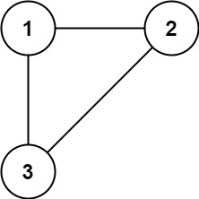

Description
树可以看作是一个连通且无环的无向图。
给定往一颗n个结点(结点值1~n)的树中添加一条边后的图。添加的边的两个顶点包含在1到n中间，且这条附加的边不属于树中已存在的边。
图的信息记录于长度为n的二维数组edges，edges[i] = [a, b]表示图中在a和b之间存在一条边。
请找出一条可以删去的边，删除后可以使得剩余部分是一个有着n个结点的树。如果有多个可以删去的边，则输出数组edges中最后出现的那条边。
   

Input
第一行输入t，表示有t个测试样例。
接着，输入n，接着输入长度为n的edges数组。
以此类推，共输入t个测试样例。
Output
每一行输出当前测试样例的结果。
共输出t行。
Sample
#0
Input
3

3
1 2
1 3
2 3

5
1 2
2 3
3 4
1 4
1 5

8
1 8
4 8
1 2
1 3
4 5
4 6
3 5
5 7
Output
2 3
1 4
3 5
Hint
n == edges.length
3 <= n <= 1000
edges[i].length == 2
1 <= a < b <= n
a != b
edges中无重复元素。
给定的图是连通的。
